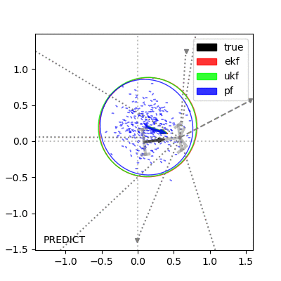

# About
Comparison of different Bayes filters on car-like vehicle with 1-D camera sensor.
Both vehicle and sensor are non-linear.

Filters:
- Extended Kalman Filter (EKF)
- Unscented Kalman Filter (UKF)
- Particle Filter (PF)



```
./bayes_cmp.py --save /tmp/bayes/img --figsize 4 --run-time 2 --seed 10
```

# Usage
Matplotlib and numpy are needed.
```
apt-get install python3-matplotlib python3-numpy
```

No command line arguments will get a reasonable run.  Change random seed to get different scenarios.
```
./bayes_cmp.py
```

Currently vehicle drives in tight circle with constant steering angle.  
Changing steering-angle (phi) or velocity requires code changes.

There are a few command line options:  
```
optional arguments:
  -h, --help            show this help message and exit
  --motion-cov-xy MOTION_COV_XY, --Rxy MOTION_COV_XY
                        Motion state noise covariance in for x and y states
  --motion-cov-th MOTION_COV_TH, --Rth MOTION_COV_TH
                        Motion state noise covariance in for theta state
  --meas-cov MEAS_COV, -Q MEAS_COV
                        1-D camera measurement covariance
  --start-cov-x START_COV_X, --Sx START_COV_X
                        Starting x-state covariance used for filters and start state
  --start-cov-y START_COV_Y, --Sy START_COV_Y
                        Starting y-state covariance used for filters and start state
  --start-cov-th START_COV_TH, --Sth START_COV_TH
                        Starting theta-state covariance used for filters and start state
  --figsize FIGSIZE     Figure size for animation
  --seed SEED           Random seed
  --num-features NUM_FEATURES
                        Mumber of features to randomly place in map
  --viz-rate VIZ_RATE   Rate to visualize bayes filters at (in Hz).
  --run-time RUN_TIME   Amount of time to run simulation
  --save SAVE           Base filenmae to save animation as
```
